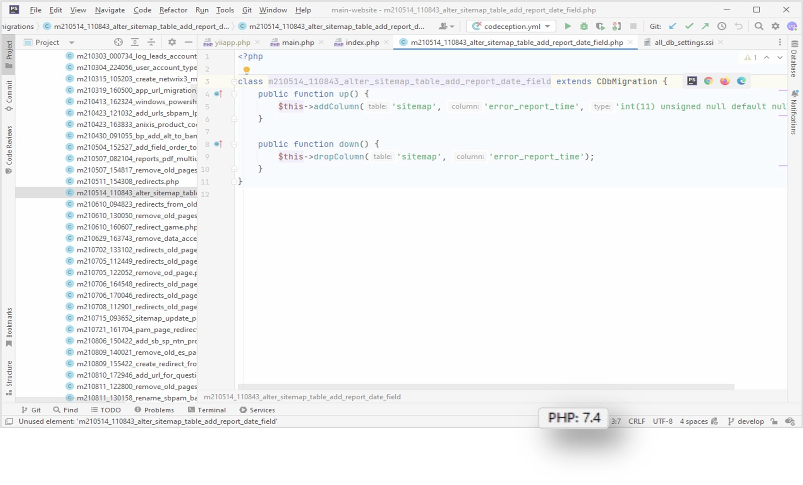

# How to update your PHP codebase without breaking the website?
PHP code update to a newer version may be a real challenge. It doesn't only require time but can also lead to website breakdowns in case the code review wasn't done accordingly. Never update the PHP codebases to a  newer PHP version then? Of course, not.

In this blog post we talk about why you need to regularly upgrade your PHP version and how to make it in a smooth and safe way with the recently released [PhpStorm 2022.2](https://blog.jetbrains.com/phpstorm/2022/08/phpstorm-2022-2-is-now-available/?utm_source=blog.jetbrains.com&utm_medium=content&utm_campaign=php-update#Rector_support).

#### Table of Contents

- [Why to update the PHP codebase?](#why-to-update)
- [Which PHP version to choose?](#which-to-choose)
    * [Any pitfalls?](#any-pitfalls)
- [How to update my PHP version with PhpStorm?](#how-to-update)

## Why to update the PHP codebase?
If everything works, why to update? That’s a rational question, however there are at least three important reasons to decide on the migration:
* **Better security**. Newer versions are better at countering hackers, for example, because outdated code is no longer supported. 
* **Faster websites**. Newer PHP versions are with faster execution times and less memory usage.
* **New features and improvements**. As with all updates, a newer version includes new features and improvements on how to do things, for example, preloading. To know more about each PHP version, look through [PHP changelogs](https://www.php.net/manual/en/doc.changelog.php). 
## Which PHP version to choose?
Obviously, the latest one. Not only because it has the best productivity, security level and the newest features but also because of **the longest supporting lifecycle**.  

All PHP versions have a lifecycle of  about three years, after which they are no longer supported. After the initial release, a PHP version is actively supported for approximately two years. After that time, there will be 1-2 years of security support, meaning that there are only releases for critical security issues. During this phase, the next PHP version is already available.
When a PHP version reaches end-of-life, it does not get updated anymore, so after that time it's no longer secure to use it. Check out [here](https://www.php.net/supported-versions.php) to see which versions are currently supported.

Tip: to know your current PHP website version, take a look at the bottom of PhpStorm. If your version is no more supported, it’s definitely time to act.

### Any pitfalls?
Not each new PHP version supports the code of the previous versions. In order not to break down your website after migration from one PHP version to another, it is recommended to check the PHP [Appendices](https://www.php.net/manual/en/appendices.php). If your current code is compatible with the new PHP version then no worries: it will work correcly after updates. 
## How to update my PHP version with PhpStorm?
Manual compatibility test of your whole code and the new version may be a heavy task: you need to make sure that every piece of code is up and running after upgrade. Needless to say, you need to consider backing up your website beforehand.  

But  after [Rector](https://getrector.org/) integration into [PhpStorm 2022.2](https://blog.jetbrains.com/phpstorm/2022/08/phpstorm-2022-2-is-now-available/#Rector_support), this process became much easier and safer. Now you are able to **automatically upgrade old PHP code** and **review all changes before applying them**. PhpStorm detects all legacy code and lets you decide what to do next.

Curious to know how to execute it? Let’s see:
1.	In order to use PhpStorm’s Rector support, you first need to [install Rector and configure it](https://github.com/rectorphp/rector#running-rector).  
  

2.	Next, you should create a new run configuration specifically for Rector. PhpStorm can do this automatically for you – simply right-click the folder you want Rector to fix and then select **Run | Rector**:

3. When Rector is done scanning, PhpStorm will give you **a list of files that it wants to change**. You can then review changes in PhpStorm, select individual files and folders, and finally apply all the selected changes.  

4. Since Rector is a run configuration, you have the option to configure it, as well. Either go to **Run | Edit Configurations** or choose **Edit Configurations** from the *Actions menu*:

Yeah, it’s that easy! Now the whole process of PHP version upgrade is under your control. Time spent is reduced, threats of website breakdowns are minimized.
__________________________________
That’s all for today. Thanks for reading, and we hope you’ll enjoy the upgrade of your PHP site with PhpStorm.
* [Download PhpStorm](https://www.jetbrains.com/phpstorm/download/?utm_source=blog.jetbrains.com&utm_medium=content&utm_campaign=php-update)
* [Tweet us](https://twitter.com/phpstorm?utm_source=blog.jetbrains.com&utm_medium=content&utm_campaign=php-update)
* Report bugs to our [issue tracker](https://youtrack.jetbrains.com/issues/WI?utm_source=blog.jetbrains.com&utm_medium=content&utm_campaign=php-update)

*Your JetBrains PhpStorm team
 The Drive to Develop*

